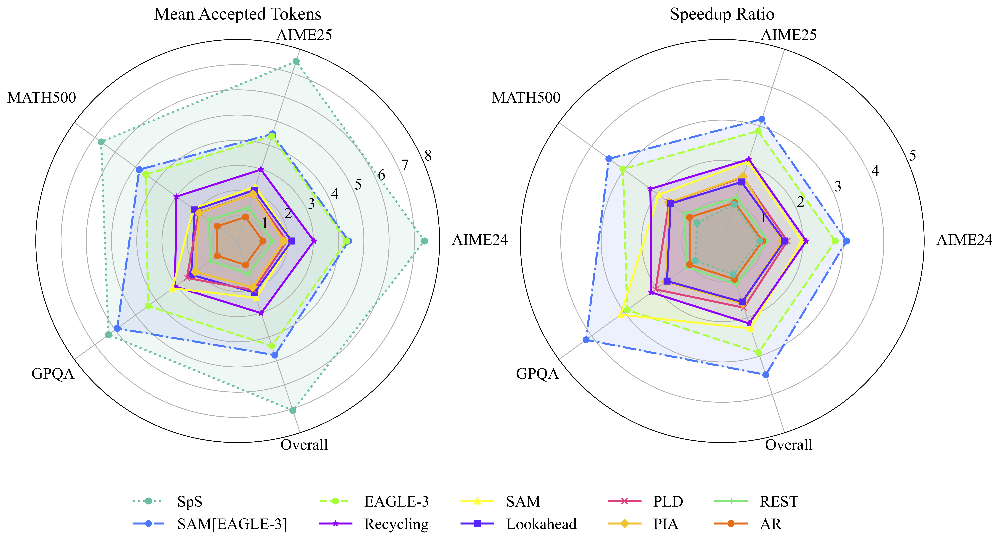

## Scaling Up, Speeding Up: A Benchmark of Speculative Decoding for Efficient LLM Test-Time Scaling


[](https://arxiv.org/abs/2501.08001)
[](https://pytorch.org/)
 

This is the Pytorch implementation for our *arXiv'25* paper: [**Scaling Up, Speeding Up: A Benchmark of Speculative Decoding for Efficient LLM Test-Time Scaling**](https://arxiv.org/abs/2509.04474). 



## Abstract
<div style="text-align: justify;">
  Test-time scaling has emerged as a powerful paradigm for enhancing the reasoning capabilities of large language models (LLMs) by allocating additional computational resources during inference. However, this paradigm is inherently inefficient due to the generation of redundant and repetitive reasoning traces, leading to significant computational overhead. Speculative decoding offers a promising avenue for mitigating this inefficiency, yet its efficacy in the structured, repetition-rich context of test-time scaling remains largely unexplored. To bridge this gap, we introduce the first comprehensive benchmark designed to evaluate speculative decoding methods for accelerating LLM test-time scaling. Our benchmark provides consistent experimental protocols across representative test-time scaling paradigms (e.g., Best-of-N sampling and multi-round thinking), enabling a fair comparison of three major categories of speculative decoding: model-based, training-based, and n-gram-based methods. Extensive experiments reveal that simple n-gram-based methods effectively capture repetitive patterns, demonstrating unique potential in accelerating test-time scaling. This phenomenon demonstrates the value of integrating n-gram-based methods with model-based or training-based approaches to balance acceleration for both repetitive and diverse reasoning in test-time scaling. We hope this benchmark spurs further research on speculative decoding for test-time scaling, enabling faster and more practical reasoning in LLMs through better handling of repetitive and diverse reasoning paths.
<div> 
<br>


Currently, SpecTTS-Bench supports the evaluation of the following open source models: [EAGLE-3](https://github.com/SafeAILab/EAGLE), [Speculative Sampling](https://huggingface.co/blog/assisted-generation), [Prompt Lookup Decoding](https://github.com/apoorvumang/prompt-lookup-decoding), [TokenRecycling](https://github.com/Luowaterbi/TokenRecycling), [REST](https://sites.google.com/view/rest-llm/), [Lookahead Decoding](https://lmsys.org/blog/2023-11-21-lookahead-decoding/), [PIA](https://github.com/alipay/PainlessInferenceAcceleration), [SAM-Decoding](https://github.com/hyx1999/SAM-Decoding), [SAM[EAGLE-3]](https://github.com/hyx1999/SAM-Decoding).

## Requirement
Install neccesary packages.
```shell
conda create -n specTTS python=3.10
torch==2.1.1+cu121
transformers==4.43.1 # for DeepSeek-R1-Distill-Llama-8B
transformers==4.53.1 # for Qwen-series
```
> More details about the environment are provided in ```./code/environment_deepseek.txt``` and ```./code/environment_qwen3.txt```.

## Run
```shell
cd code
bash scripts/deepseek.sh # bash scripts/qwen3.sh
```
> We provide the checkpoints for REST [here](https://portland-my.sharepoint.com/:f:/g/personal/shengysun4-c_my_cityu_edu_hk/EoZzeoHajTFDpgKrnsdI7xsB5Hpls0u9kHDUKdqa1MrEnA?e=I2NmXZ).

## Model Weight
Download corresponding model weights (if required) and modify the checkpoint path in ```code/scripts/*```.

| Model | Type | URL |
| :--- | :--- | :--- |
| DeepSeek-R1-Distill-Llama-8B | Target Model | [Link](https://huggingface.co/deepseek-ai/DeepSeek-R1-Distill-Llama-8B) |
| Qwen3-4B | Target Model | [Link](https://huggingface.co/Qwen/Qwen3-4B) |
| Qwen3-8B | Target Model | [Link](https://huggingface.co/Qwen/Qwen3-8B) |
| Qwen3-14B | Target Model | [Link](https://huggingface.co/Qwen/Qwen3-14B) |
| Qwen3-0.6B | Draft Model | [Link](https://huggingface.co/Qwen/Qwen3-0.6B) |
| EAGLE3-DeepSeek-R1-Distill-LLaMA-8B | Draft Model | [Link](https://huggingface.co/yuhuili/EAGLE3-DeepSeek-R1-Distill-LLaMA-8B) |
| EAGLE3-Qwen3-4B | Draft Model | [Link](https://huggingface.co/AngelSlim/Qwen3-4B_eagle3) |
| EAGLE3-Qwen3-8B | Draft Model | [Link](https://huggingface.co/Tengyunw/qwen3_8b_eagle3) |
| EAGLE3-Qwen3-14B | Draft Model | [Link](https://huggingface.co/AngelSlim/Qwen3-14B_eagle3) |


## Acknowledgment of Open-Source Code Contributions  

  The code is based on the open-source repositories: [Spec-Bench](https://github.com/hemingkx/Spec-Bench), [EAGLE](https://github.com/SafeAILab/EAGLE), and [Medusa](https://github.com/FasterDecoding/Medusa), many thanks to the authors! 

You are welcome to cite our paper:
```
@inproceedings{SunLi25,
  title={Scaling Up, Speeding Up: A Benchmark of Speculative Decoding for Efficient LLM Test-Time Scaling},
  author={Shengyin Sun, Yiming Li, Xing Li, Yingzhao Lian, Weizhe Lin, Hui-Ling Zhen, Zhiyuan Yang, Chen Chen, Xianzhi Yu, Mingxuan Yuan, Chen Ma},
  booktitle={arXiv:2509.04474},
  year={2025}
}
```
